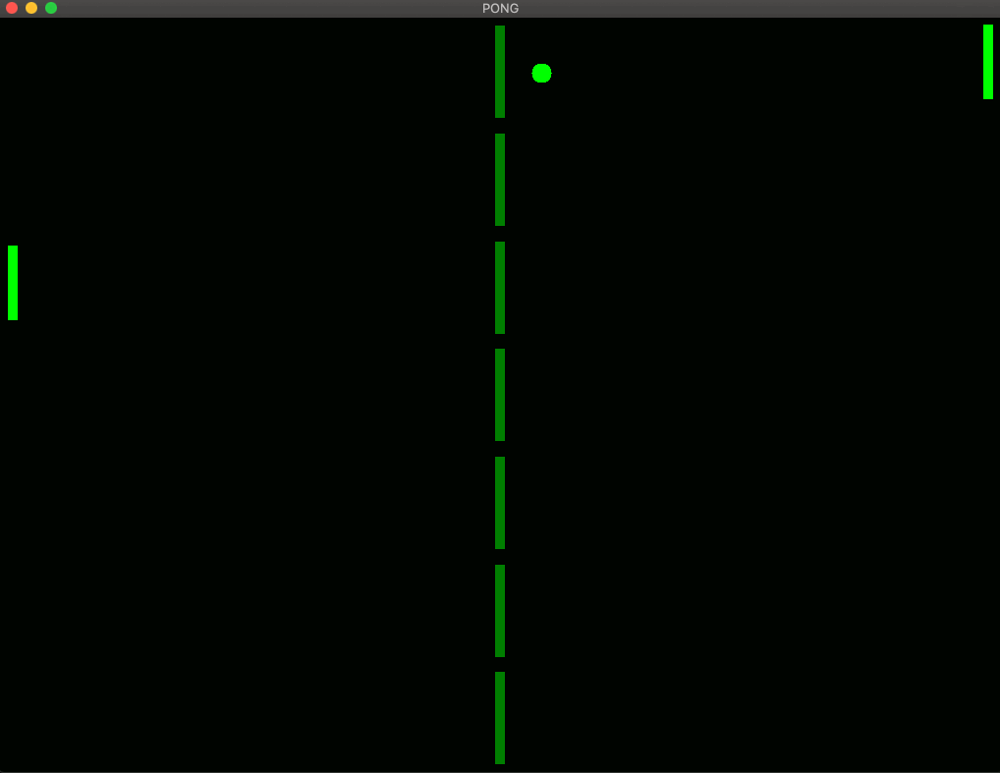

# PONG


The classic tennis for two. Simple as that. </br>



## Dependencies for Running Locally
---
* cmake >= 3.7
  * All OSes: [click here for installation instructions](https://cmake.org/install/)
* make >= 4.1 (Linux, Mac), 3.81 (Windows)
  * Linux: make is installed by default on most Linux distros
  * Mac: [install Xcode command line tools to get make](https://developer.apple.com/xcode/features/)
  * Windows: [Click here for installation instructions](http://gnuwin32.sourceforge.net/packages/make.htm)
* SDL2 >= 2.0
  * All installation instructions can be found [here](https://wiki.libsdl.org/Installation)
  * Note that for Linux, an `apt` or `apt-get` installation is preferred to building from source.
* gcc/g++ >= 5.4
  * Linux: gcc / g++ is installed by default on most Linux distros
  * Mac: same deal as make - [install Xcode command line tools](https://developer.apple.com/xcode/features/)
  * Windows: recommend using [MinGW](http://www.mingw.org/)

## Basic Build Instructions
---
1. Clone this repo.
2. Make a build directory in the top level directory: `mkdir build && cd build`
3. Compile: `cmake .. && make`
4. Run it: `./pong`.

## Class Structure
---
This project is split into many helpful classes. There are 3 main classes that make up the game play objects:
  * `Ball`
  * `AIPaddle`
  * `PlayerPaddle`

All these classes inherit from the abstract class `Interactive`. Additional elements rendered on the screen share the same base class of `Drawable`.
`Drawable` is composed of 2 classes:
  * `Location`
  * `Color`

`Interactive` adds support members for running a multithreaded update environment. Mostly this comes down to:
```c++
// variables
std::mutex Interactive::_mtx;
std::chrono::high_resolution_clock::time_point _last;
std::vector<std::thread> _threads;

// methods
virtual void Interactive::Stop();
virtual void Interactive::Act() = 0;
virtual void Interactive::_move() = 0;
```
These functions form the basis of an interface, along with the functions from `Drawable`
```c++
std::shared_ptr<Location> Drawable::getLocationPointer();
Location Drawable::getLocation();
Color Drawable::getColor();

```
All drawable objects inherit from `Drawable`, and all objects which move inherit from `Interactive`, which in turn inherits from `Drawable`.

## Folder Organization
---
The folder hierarchy is simple:
  * img
    * pong.gif
  * src
    * include
      * *.h (header files)
    * *.cpp (implementation files)

## Rubric Points
1. Control structures / functions:
    * All functionality is contained within member functions except for the 3 lines in main required to start things off.
    * Many if/else statements throughout, especially in `Ball::_move()` and `Ball::checkPaddleCollision()` (src/ball.cpp:21 -88)
    * Loops are used throughout, such as the `Renderer::_render` loop (src/renderer.cpp:65-87)
2. User input:
    * Keyboard input is used to control the player paddle movements (src/game.cpp:99-102)
3. Code is organized into classes with attributes to hold data:
    * Everywhere except `main()`
    * Many methods to perform tasks throughout.
      * `Renderer::SetScreenSize()` (src/include/renderer.h:26)
      * `Renderer::SetDrawable()` and `Renderer::ClearDrawable()` (src/renderer.cpp:143-153)
      * Almost every class has a `Stop()` method used to safely wind the program down and untangle the web of threads and shared_ptr's. (src/include/interactive.h:20-23) (src/include/renderer.h:29)
4. All class data members specified as public, protected, or private:
    * All classes keep data private (or protected in the case of base classes) and have getter methods. Look at any .h file to see this implemented
5. Class constructors utilize member initialization lists.
    * Except from `Renderer` and `Game` where most of the setup work is completed all constructors use initilization lists to set all applicable class members.
6. Classes abstract implementation details from their interfaces.
    * Documentation through naming approch.
      * `Drawable::getLocationPointer()` returns a (shared) pointer to the _location member (src/include/drawable.h:14)
      * `Drawable::getColor()` returns a `Color` object (src/include/drawable.h:16)
      * `Location::Move(double, double)` moves the Location by the specified values (src/include/location.h:23)
      * `Location` has getter methods `X()`, `Y()`, `W()`, `H()` which do exactly what you'd expect (src/include/location.h:18-21)
7. Classes encapsulate behavior.
    * See above examples. Invarients were not encountered here (for example, (0.1, -0.003) would be a valid location because paddles can have their origin off the canvas). Where values might be invalid they were handled by the derived class:
      * In `Ball::_move()` a bounds check must be performed (src/ball.cpp:34-40)
      * In `Paddle::_move()` the paddle mustn't be allowed more than half off the screen (src/Paddle.cpp:14+18)
    * `Location` declares friend classes so that `Paddle` and `Ball` can use the setter functions, but `Renderer`, for example, cannot. (src/include/Location.h:9-11,22-25)
8. Classes follow an appropriate inheritance hierarchy.
    * `Drawable` uses composition, making a class out of `Color` and `Location`. (src/include/drawable.h)
    *  Other classes follow inheritance:
      </br>
      * `Drawable`
        * `Interactive`
          * `Ball`
          * `Paddle`
            * `AIPadle`
            * `PlayerPaddle`
9. Overloaded functions allow the same function to operate on different parameters.
    * Many getter/setters are diferentiated by function signature:
      * `Location` overloads `X()` and `Y()` as a getter or setter (src/include/location.h:18-25)
10. Derived class functions override virtual base class functions.
    * `Ball`, `AIPaddle`, and `PlayerPadle` all override `Interactive::Act()` (src/include interactive.h:29, ball.h:18, ai_paddle.h:13, player_paddle.h:8, src/ ball.cpp:17-19, ai_paddle.cpp:7-11, player_paddle.cpp:4-6)
11. The project uses smart pointers instead of raw pointers.
    * All drawable objects are held as shared_ptr by `Game::_pieces` (src/include/game.h:15-20) and passed to render as `std::vector<std::shared_ptr<Drawable>>` (src/game.cpp:45)
    * `Drawable::_location` is a shared pointer, because objects often need a reference to the location of another object (src/include/drawable.h:19)
    * `Drawable::getLocationPtr()` returns a shared pointer to `_location`(src/include/drawable.h:14)
12. The project uses multithreading.
    * All `Interactive` objects have `_move()` function which launches a new thread to update location. 
    * `Game` launches a `_monitor` loop to catch keyboard, window resize, and quit events sent from the main thread.
13. A mutex or lock is used in the project.
    * All `Interactive` objects have `std::mutex _mtx;` available. This is used primarily of ensureing that when shared pointers are being discarded the `_move()` loop or `AIPaddle::ai()` isnt trying to access them.
14. A condition variable is used in the project.
    * `Game::_monitor` uses a `MessageQueue`, which in turn uses `std::condition_variable MessageQueue::_c_v` to alert/wake the monitoring thread. (src/include/message_queue.h:18,22,30)